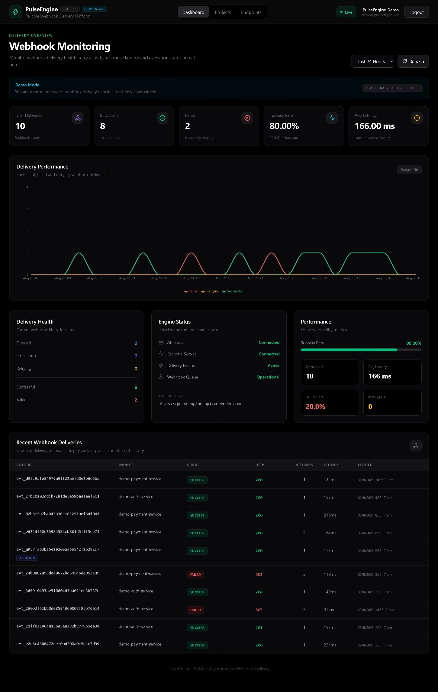
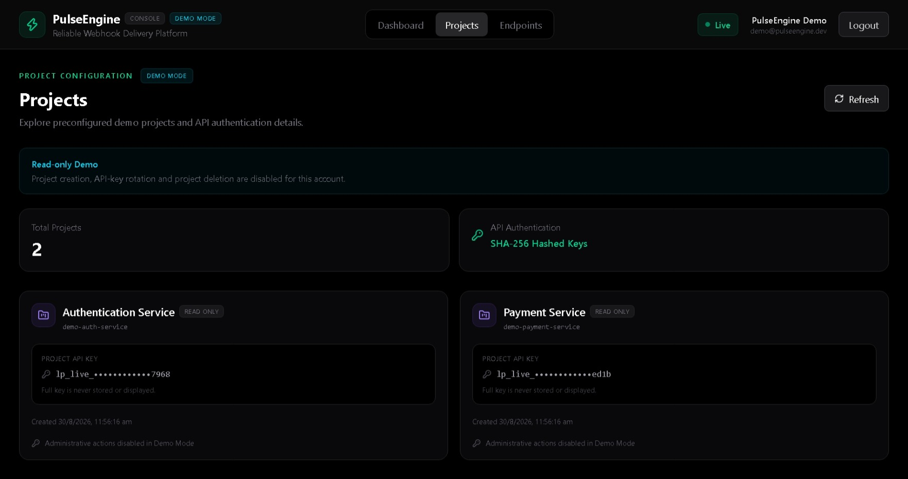
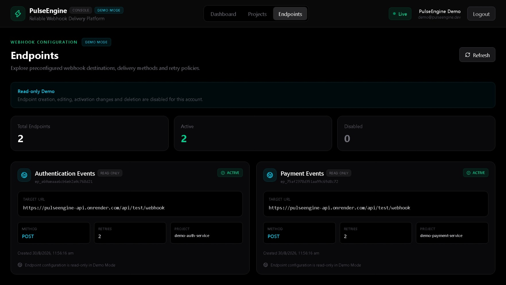
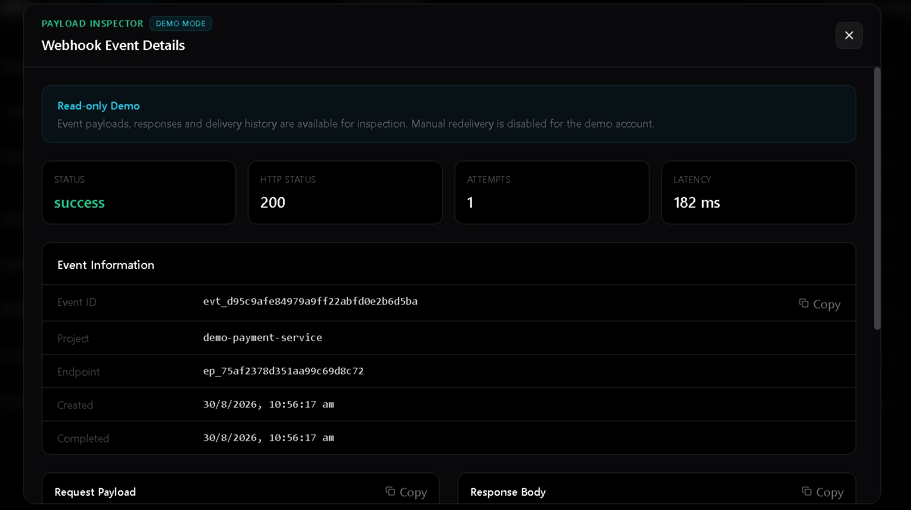
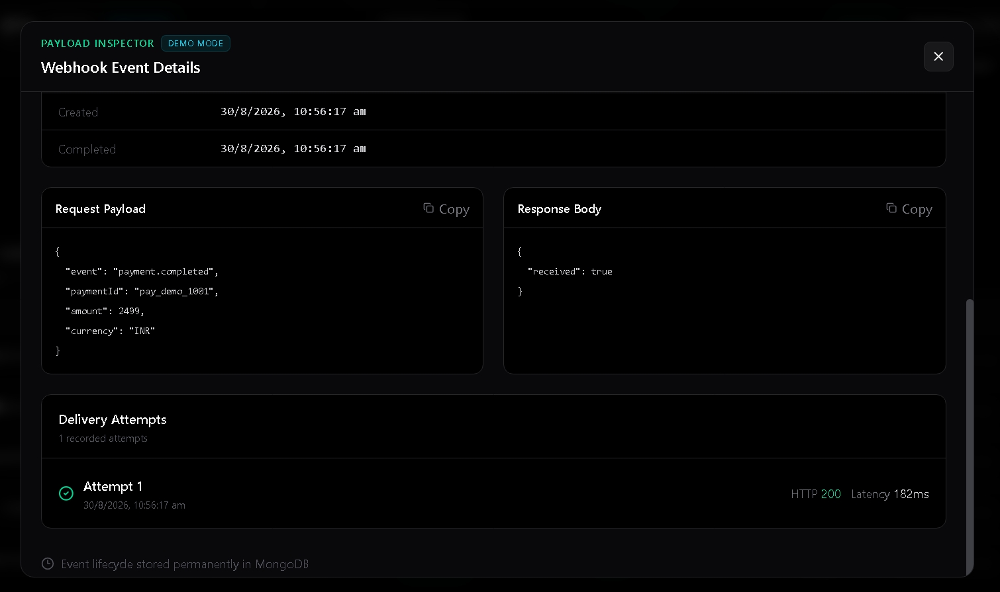
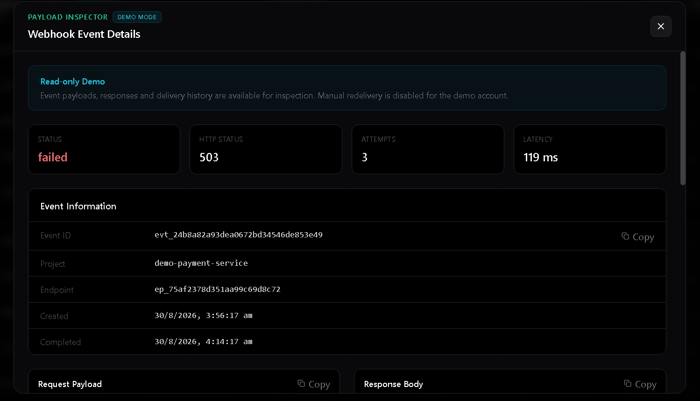
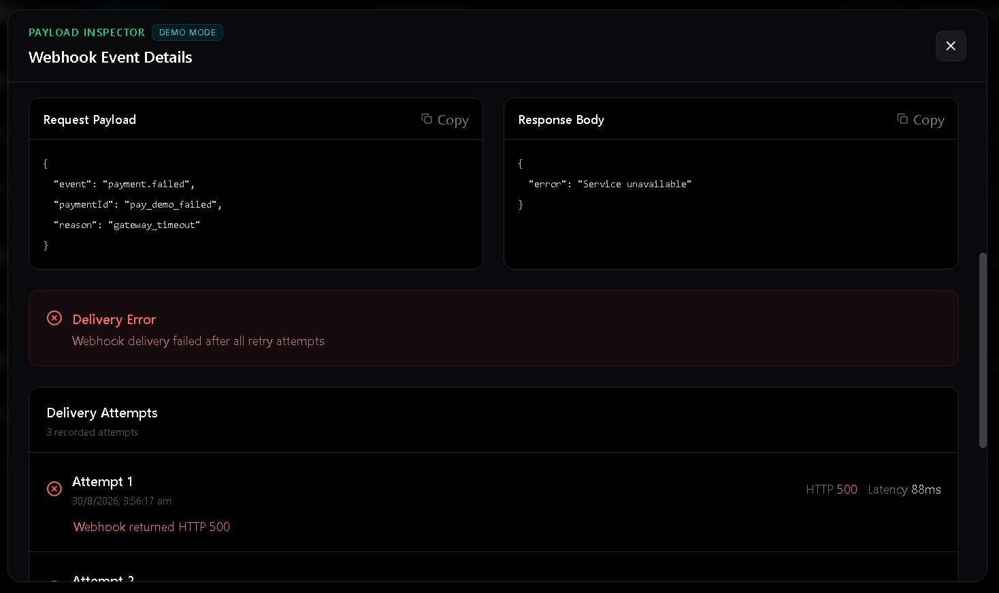
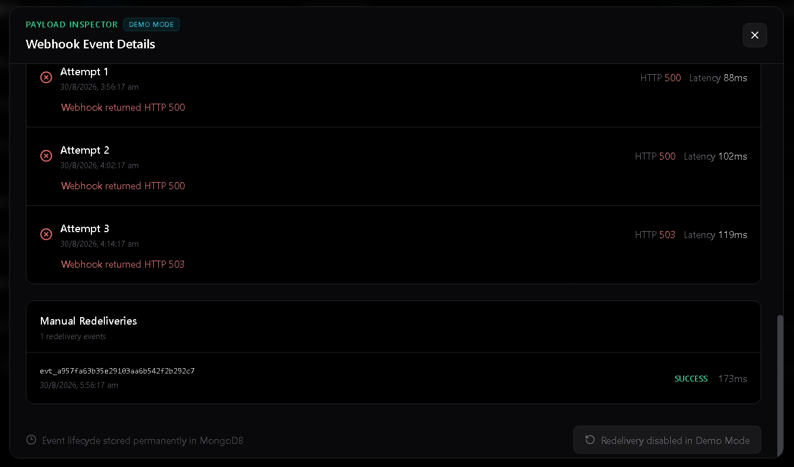
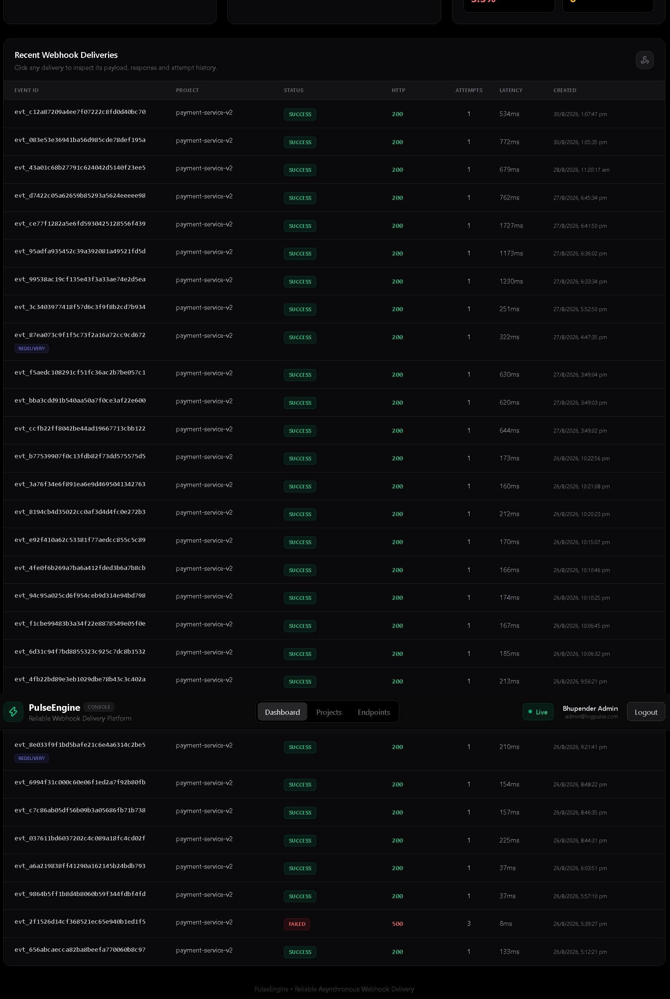

# PulseEngine

> A real-time asynchronous webhook delivery and monitoring platform built with TypeScript, Node.js, Redis, BullMQ, MongoDB Atlas, Socket.IO, and React.

[](https://logpulse-3dgx.vercel.app/)
[](https://pulseengine-api.onrender.com)
[](https://www.typescriptlang.org/)
[](https://redis.io/)
[](https://www.mongodb.com/)

**Live Application:**  
https://logpulse-3dgx.vercel.app/

**Backend API:**  
https://pulseengine-api.onrender.com

**Health Check:**  
https://pulseengine-api.onrender.com/api/health

**Repository:**  
https://github.com/bhupender2412/logpulse

---

## Table of Contents

- [Overview](#overview)
- [Project at a Glance](#project-at-a-glance)
- [Application Walkthrough](#application-walkthrough)
- [Features](#features)
- [Tech Stack](#tech-stack)
- [Architecture](#architecture)
- [Webhook Delivery Flow](#webhook-delivery-flow)
- [Retry Flow](#retry-flow)
- [Webhook Dispatch API](#webhook-dispatch-api)
- [HMAC Webhook Signing](#hmac-webhook-signing)
- [Authentication](#authentication)
- [Role-Based Access Control](#role-based-access-control)
- [Real-Time Event Isolation](#real-time-event-isolation)
- [Project API-Key Security](#project-api-key-security)
- [Endpoint Configuration](#endpoint-configuration)
- [Webhook Event Model](#webhook-event-model)
- [Analytics](#analytics)
- [Main API Routes](#main-api-routes)
- [Local Development](#local-development)
- [Production Build](#production-build)
- [Deployment](#deployment)
- [Demo Data](#demo-data)
- [Security Notes](#security-notes)
- [Screenshots](#screenshots)
- [Production Links](#production-links)
- [Author](#author)

---

# Overview

PulseEngine is a real-time webhook delivery and monitoring platform designed to process outgoing webhook events asynchronously and reliably.

Instead of waiting for a target webhook endpoint to respond inside the Express request lifecycle, the dispatch API authenticates the project, validates the request, creates a webhook event, pushes a BullMQ job into Redis, and immediately returns `202 Accepted`.

A separate webhook worker consumes queued jobs, signs outgoing payloads using HMAC SHA-256, performs the HTTP delivery, records every delivery attempt in MongoDB, and automatically retries failed deliveries according to the endpoint retry configuration.

Redis Pub/Sub is used to publish webhook lifecycle changes from the worker to the API process. Socket.IO then forwards those events to authenticated users in real time.

The React dashboard provides visibility into delivery status, latency, failures, retries, request payloads, responses, attempt history, projects, endpoints, and analytics.

---

# Project at a Glance

## What Problem Does PulseEngine Solve?

Modern applications frequently need to notify another system when an event occurs.

Examples include:

```text
payment.completed
order.created
subscription.renewed
user.registered
invoice.generated
security.alert
```

A simple implementation may send the webhook directly inside the original application request:

```text
Application Request
        |
        v
Send Webhook
        |
        v
Wait for External Server
        |
        v
Return Response
```

This creates several problems:

- A slow webhook receiver makes the original request slower.
- A temporarily unavailable receiver can cause delivery failures.
- Retry logic has to be implemented manually.
- Delivery history is difficult to inspect.
- Developers may not know what payload was sent or what response came back.
- Debugging intermittent webhook failures becomes difficult.

PulseEngine moves webhook delivery out of the original request lifecycle.

```text
Client
   |
   v
PulseEngine Dispatch API
   |
   | 202 Accepted
   v
BullMQ Queue
   |
   v
Webhook Worker
   |
   v
Target Endpoint
```

The API accepts the event quickly, while the worker performs the network delivery asynchronously.

PulseEngine also stores the complete delivery lifecycle so developers can answer questions such as:

```text
Was the webhook delivered?
How many attempts were made?
What HTTP status was returned?
How long did the request take?
What payload was sent?
What response came back?
Why did the request fail?
Was the event retried?
Was it manually redelivered?
```

This makes webhook delivery more reliable, observable, and easier to debug.

## Who Would Use PulseEngine?

PulseEngine is useful for applications and teams that need reliable outgoing webhook delivery.

### Backend Developers

Backend developers can use a centralized delivery service instead of implementing retries, signing, delivery history, monitoring, and redelivery logic separately in every project.

Example:

```text
E-commerce Backend
        |
        v
PulseEngine
        |
        +----> Inventory Service
        |
        +----> CRM
        |
        +----> Analytics Platform
```

### SaaS Applications

A SaaS application may need to notify customer systems about events such as:

```text
invoice.created
payment.completed
subscription.cancelled
user.created
report.generated
```

PulseEngine can queue and deliver those events reliably.

### Platform and Infrastructure Teams

A platform team can centralize webhook delivery for multiple internal services.

```text
Service A ----\
Service B -----\
Service C ------> PulseEngine ------> External Systems
Service D -----/
```

### Developers Debugging Webhook Integrations

The dashboard helps developers inspect:

- Payloads
- Responses
- HTTP status codes
- Latency
- Errors
- Attempt history
- Retry history
- Redelivery history

## What Can I Actually Do in the UI?

PulseEngine includes a React-based monitoring and administration console.

### Dashboard

The dashboard displays:

- Total webhook deliveries
- Successful deliveries
- Failed deliveries
- Success rate
- Failure rate
- Average delivery latency
- Delivery activity over time
- Recent webhook events
- Project filters
- Endpoint filters
- Status filters
- Real-time Socket.IO connection status

### Project Management

Administrators can:

- Create projects
- Generate project API keys
- View masked API-key information
- Rotate API keys
- Delete projects

Each project has its own API key used to authenticate webhook dispatch requests.

### Endpoint Management

Administrators can configure webhook destinations.

Each endpoint contains:

- Endpoint ID
- Project association
- Target webhook URL
- HTTP method
- Maximum retry count
- HMAC signing secret
- Active or disabled state

Administrators can create, edit, enable, disable, and delete endpoints.

### Event Inspection

Every webhook event can be opened in the Payload Inspector.

The inspector displays:

- Event ID
- Project
- Endpoint
- Delivery status
- HTTP status
- Latency
- Request payload
- Response body
- Error information
- Attempt count
- Attempt history
- Completion timestamps
- Redelivery history

### Failed Delivery Investigation

Failed webhook events show the complete delivery attempt sequence.

Example:

```text
Attempt 1
HTTP 500
Failed
     |
     v
Attempt 2
HTTP 500
Failed
     |
     v
Attempt 3
HTTP 503
Failed
```

Administrators can manually redeliver events that remain failed after automatic retries.

### Real-Time Monitoring

Webhook lifecycle events appear on the dashboard without requiring a page refresh.

```text
Webhook Worker
      |
      v
Redis Pub/Sub
      |
      v
API Server
      |
      v
Socket.IO
      |
      v
React Dashboard
```

## How Do I Try It?

A public read-only demo is available at:

https://logpulse-3dgx.vercel.app/

Open the application and click:

```text
Try Live Demo
```

No account creation is required.

The demo environment contains preloaded:

- Projects
- Endpoints
- Successful webhook events
- Failed webhook events
- Retry scenarios
- Redelivery history
- Request payloads
- Response bodies
- Latency measurements
- Analytics

The demo account can inspect the platform but cannot modify production configuration.

The following operations are disabled in Demo Mode:

```text
Create projects
Delete projects
Rotate API keys
Create endpoints
Edit endpoints
Enable or disable endpoints
Delete endpoints
Manually redeliver failed events
```

These restrictions are enforced by backend authorization as well as the frontend interface.

## What Makes PulseEngine Technically Interesting?

PulseEngine combines several backend and distributed-system concepts rather than operating as a simple CRUD application.

### 1. Asynchronous Request Processing

Webhook delivery is separated from the original API request.

```text
POST /api/v1/dispatch
        |
        v
Validate Request
        |
        v
Store Event
        |
        v
Queue BullMQ Job
        |
        v
202 Accepted
```

The worker performs the actual network request later.

### 2. Redis and BullMQ Job Processing

Redis provides the infrastructure for BullMQ.

```text
Express API
    |
    v
BullMQ
    |
    v
Redis
    |
    v
Webhook Worker
```

The worker processes jobs independently from the API request lifecycle.

### 3. Automatic Retry Handling

Webhook endpoints can configure retry limits.

Failed requests are retried using backoff behavior, and every attempt is stored separately.

### 4. HMAC SHA-256 Webhook Signing

Outgoing webhook requests are cryptographically signed.

```text
timestamp + "." + payload
          |
          v
     HMAC SHA-256
          |
          v
Webhook Signature
```

The receiving system can verify the signature using its endpoint signing secret.

### 5. Replay Protection

Signed requests contain timestamp information so receiving systems can reject stale webhook requests outside the allowed replay-protection window.

### 6. Secure Project API Keys

Project API keys are not stored in plaintext.

PulseEngine stores:

```text
apiKeyHash
apiKeyLast4
```

The raw key is shown only when generated or rotated.

Redis is used to cache validated API-key lookups, and previous cache entries are invalidated when a key is rotated.

### 7. Real-Time Worker-to-Dashboard Communication

The worker publishes delivery updates through Redis Pub/Sub.

```text
Worker
   |
   v
Redis Pub/Sub
   |
   v
API Server
   |
   v
Socket.IO
   |
   v
Browser
```

This allows asynchronous background work to appear immediately in the user interface.

### 8. User-Isolated Socket.IO Rooms

Socket.IO connections are authenticated using JWT.

Each user joins a dedicated room:

```text
user:<userId>
```

Webhook lifecycle events are emitted only to the owner of the corresponding data.

### 9. Complete Delivery Audit Trail

PulseEngine stores individual delivery attempts rather than only the final result.

Example:

```text
Attempt 1
503
91 ms
Failed

Attempt 2
503
103 ms
Failed

Attempt 3
200
164 ms
Success
```

### 10. Read-Only Public Demo

The production application includes a dedicated:

```text
role: demo
```

The demo account uses isolated preloaded data and can inspect the platform without modifying production configuration.

Backend authorization prevents restricted actions even if someone bypasses the React interface and calls the API directly.

## How Is PulseEngine Deployed?

The production application uses multiple managed services.

```text
                    Internet
                       |
              +--------+--------+
              |                 |
              v                 v
           Vercel             Render
        React Frontend      API + Worker
                                |
                         +------+------+
                         |             |
                         v             v
                       Redis       MongoDB Atlas
```

### Frontend

The React frontend is deployed on Vercel.

Production URL:

https://logpulse-3dgx.vercel.app/

### Backend

The Node.js and Express backend is deployed on Render.

Production API:

https://pulseengine-api.onrender.com

Health endpoint:

https://pulseengine-api.onrender.com/api/health

### Webhook Worker

For the current portfolio deployment, the webhook worker runs as a separate Node.js process alongside the API process inside the same Render service.

```text
Render Service
      |
      +-----------------------+
      |                       |
      v                       v
API Process              Worker Process
node dist/server.js      node dist/workers/webhookWorker.js
```

The processes communicate through Redis and MongoDB rather than relying on shared in-memory state.

### Database

Application data is persisted in MongoDB Atlas.

### Queue, Cache, Rate Limiting, and Pub/Sub

Redis is used for:

```text
BullMQ queue
API-key caching
Per-project rate limiting
Redis Pub/Sub
Realtime worker events
```

## How Do I Reproduce It Locally?

Clone the repository:

```bash
git clone git@github.com:bhupender2412/logpulse.git
cd logpulse
```

### 1. Configure the Backend

```bash
cd backend
npm install
```

Create:

```text
backend/.env
```

using:

```text
backend/.env.example
```

Provide your own configuration for:

```text
MongoDB
Redis
JWT
CORS
Application environment
```

Build the backend:

```bash
npm run build
```

### 2. Start the API

```bash
npm run dev:server
```

### 3. Start the Worker

Open another terminal:

```bash
cd backend
npm run dev:worker
```

Both processes should run for the complete webhook-delivery pipeline.

```text
Terminal 1
API Server

Terminal 2
Webhook Worker
```

### 4. Configure the Frontend

Open another terminal:

```bash
cd frontend
npm install
```

Create the frontend environment file using:

```text
frontend/.env.example
```

and point the frontend to the local backend.

Start the frontend:

```bash
npm run dev
```

The Vite development server normally runs at:

```text
http://localhost:5173
```

### 5. Verify the Backend

```bash
curl http://localhost:4000/api/health
```

A healthy local environment should report MongoDB and Redis as connected.

### 6. Local Architecture

```text
React / Vite
http://localhost:5173
        |
        v
Express API
http://localhost:4000
        |
        +------> MongoDB
        |
        +------> Redis / BullMQ
                    |
                    v
               Webhook Worker
```

---

# Application Walkthrough

## 1. Dashboard

The main dashboard provides a high-level view of webhook delivery activity.

It displays:

- Total deliveries
- Successful deliveries
- Failed deliveries
- Success and failure rates
- Average latency
- Delivery activity over time
- Project, endpoint, and status filters
- Recent webhook deliveries
- Real-time Socket.IO connection status

The dashboard updates as delivery lifecycle events are processed.



---

## 2. Project Management

Projects isolate webhook traffic between applications and services.

Each project receives a dedicated API key used to authenticate webhook dispatch requests.

Project functionality includes:

- Create projects
- Generate project API keys
- Store only hashed API keys
- Display only the last four characters of stored keys
- Rotate API keys
- Invalidate previous Redis API-key cache entries
- Delete projects
- Enforce user ownership

Demo users can inspect projects but cannot create, rotate, or delete them.



---

## 3. Endpoint Configuration

Webhook endpoints define where PulseEngine should deliver events.

Each endpoint contains:

- Endpoint ID
- Friendly name
- Project association
- Target webhook URL
- HTTP method
- Maximum retry count
- HMAC signing secret
- Active or disabled status

Supported methods:

```text
POST
PUT
PATCH
```

Administrators can create, edit, enable, disable, and delete endpoints.

Demo users receive read-only access.



---

## 4. Event Details

Every webhook event can be inspected using the Payload Inspector.

The event details view includes:

- Event ID
- Project ID
- Endpoint ID
- Delivery status
- HTTP response status
- Delivery latency
- Attempt count
- Request payload
- Response body
- Delivery errors
- Creation timestamp
- Completion timestamp
- Delivery attempt history
- Manual redelivery history

### Event Summary and Payload



### Delivery Attempts and Additional Details



---

## 5. Failed Delivery and Retry Handling

PulseEngine automatically retries failed webhook deliveries according to the endpoint retry configuration.

Each attempt is stored independently with:

- Attempt number
- Attempt status
- HTTP status code
- Request latency
- Response body
- Error message
- Attempt timestamp

A failed delivery may look like:

```text
Attempt 1
HTTP 500
Failed
    |
    v
Backoff
    |
    v
Attempt 2
HTTP 500
Failed
    |
    v
Backoff
    |
    v
Attempt 3
HTTP 503
Failed
```

Another event may recover on a later attempt:

```text
Attempt 1
HTTP 503
Failed
    |
    v
Retry
    |
    v
Attempt 2
HTTP 200
Success
```

Administrators can manually redeliver webhook events that remain failed after automatic retries.

Manual redelivery creates a new webhook event linked to the original through the `redeliveryOf` field, preserving the original delivery history.

Manual redelivery is disabled for Demo Mode.

### Failed Event Summary



### Delivery Attempt History



### Error and Redelivery Information



---

## 6. Real-Time Updates

Webhook processing takes place asynchronously in the worker process.

The worker publishes lifecycle changes through Redis Pub/Sub.

The API server receives those messages and forwards them to authenticated clients through Socket.IO.

```text
Webhook Dispatch
       |
       v
BullMQ Queue
       |
       v
Webhook Worker
       |
       v
Redis Pub/Sub
       |
       v
Socket.IO Server
       |
       v
Authenticated User Room
       |
       v
React Dashboard
```

Realtime lifecycle states include:

```text
processing
retrying
success
failed
```

Socket.IO connections are authenticated using JWT.

Each dashboard user joins an isolated room:

```text
user:<userId>
```

The screenshot below shows a production webhook event appearing on the dashboard through the real-time pipeline.



---

# Features

## Webhook Delivery

- Asynchronous webhook delivery
- BullMQ-based background job processing
- Redis-backed delivery queue
- Dedicated worker process
- Configurable retry limits
- Automatic retries
- Backoff between failed attempts
- Delivery attempt tracking
- Manual redelivery of failed webhook events
- HTTP response-status tracking
- Response-body storage
- Delivery latency monitoring

## Security

- JWT dashboard authentication
- Role-based authorization
- Admin and demo roles
- Read-only demo mode
- Project API-key authentication
- SHA-256 API-key hashing
- API-key rotation
- Redis API-key caching
- API-key cache invalidation
- HMAC SHA-256 webhook signing
- Timestamp-based replay protection
- Per-project Redis rate limiting
- User-isolated Socket.IO rooms

## Monitoring

- Real-time webhook updates
- Delivery status analytics
- Success-rate calculation
- Failure-rate calculation
- Average latency
- Time-series charts
- Project filtering
- Endpoint filtering
- Status filtering
- Event pagination
- Payload inspection
- Response inspection
- Attempt history
- Redelivery history

---

# Tech Stack

## Frontend

- React
- TypeScript
- Tailwind CSS
- Recharts
- Socket.IO Client
- Vite

## Backend

- Node.js
- Express
- TypeScript
- BullMQ
- Redis
- Socket.IO
- MongoDB
- Mongoose
- JSON Web Tokens
- Zod
- bcryptjs
- Axios

## Infrastructure

- MongoDB Atlas
- Hosted Redis
- Render
- Vercel
- GitHub

---

# Architecture

```text
                    Client / Service
                           |
                           |
                    X-Pulse-API-Key
                           |
                           v
                +---------------------+
                | Express Dispatch API|
                +---------------------+
                           |
                  POST /api/v1/dispatch
                           |
                           v
                     202 Accepted
                           |
                           v
                +---------------------+
                |   Redis / BullMQ    |
                |  webhook-delivery   |
                +---------------------+
                           |
                           v
                +---------------------+
                |   Webhook Worker    |
                +---------------------+
                           |
                  HMAC SHA-256 Signing
                           |
                     HTTP Delivery
                           |
                    Retry / Backoff
                           |
                           v
                +---------------------+
                | Target Webhook URL  |
                +---------------------+
                           |
                           v
                    MongoDB Atlas
                 Delivery Persistence


                  Webhook Worker
                         |
                         v
                    Redis Pub/Sub
                         |
                         v
                   Socket.IO Server
                         |
                         v
                Authenticated User Room
                         |
                         v
                   React Dashboard
```

---

# Webhook Delivery Flow

A normal webhook delivery follows this sequence:

```text
Client
  |
  v
Dispatch API
  |
  | Validate Project API Key
  | Apply Rate Limit
  | Validate Endpoint
  |
  v
Create Webhook Event
  |
  v
Add BullMQ Job
  |
  v
202 Accepted
  |
  v
Webhook Worker
  |
  | Generate HMAC Signature
  |
  v
Target Endpoint
  |
  v
Store Delivery Result
  |
  v
Redis Pub/Sub
  |
  v
Socket.IO
  |
  v
Dashboard Update
```

---

# Retry Flow

When a webhook delivery fails, BullMQ retries the request according to the endpoint retry configuration.

Example:

```text
Attempt 1
HTTP 503
Failed
    |
    v
Backoff
    |
    v
Attempt 2
HTTP 503
Failed
    |
    v
Backoff
    |
    v
Attempt 3
HTTP 200
Success
```

Each attempt is stored individually in MongoDB so the dashboard can show the complete delivery lifecycle rather than only the final state.

---

# Webhook Dispatch API

## Endpoint

```http
POST /api/v1/dispatch
```

## Required Headers

```http
Content-Type: application/json
X-Pulse-API-Key: <project-api-key>
```

## Example Request

```json
{
  "endpointId": "ep_example",
  "payload": {
    "event": "payment.completed",
    "orderId": "ORD-1001",
    "amount": 2499,
    "currency": "INR"
  }
}
```

A successfully accepted request returns:

```http
202 Accepted
```

Example response:

```json
{
  "success": true,
  "eventId": "evt_example",
  "jobId": "evt_example",
  "projectId": "payment-service",
  "endpointId": "ep_example",
  "status": "queued",
  "message": "Webhook accepted for delivery"
}
```

The webhook is processed asynchronously after this response.

---

# HMAC Webhook Signing

PulseEngine signs outgoing webhook requests using HMAC SHA-256.

Conceptually:

```text
timestamp + "." + requestBody
             |
             v
        HMAC SHA-256
             |
             v
      Webhook Signature
```

The receiving endpoint can use its signing secret to verify that the webhook was generated by PulseEngine.

Timestamp validation is used to reduce replay risk.

---

# Authentication

PulseEngine uses separate authentication mechanisms for dashboard users and webhook-producing services.

## Dashboard Authentication

Dashboard users authenticate using email and password.

```text
Email + Password
       |
       v
Authentication API
       |
       v
JWT
       |
       v
Protected Dashboard APIs
```

## Project Authentication

External services authenticate webhook dispatch requests using:

```http
X-Pulse-API-Key: <project-api-key>
```

Project API keys are not stored in plaintext.

MongoDB stores:

```text
apiKeyHash
apiKeyLast4
```

---

# Role-Based Access Control

PulseEngine currently supports:

```text
admin
demo
```

## Admin Role

Administrators can:

- View analytics
- Inspect webhook events
- Create projects
- Rotate project API keys
- Delete projects
- Create endpoints
- Edit endpoints
- Enable or disable endpoints
- Delete endpoints
- Manually redeliver failed webhook events

## Demo Role

Demo users can:

- View dashboard analytics
- View projects
- View endpoint configuration
- View webhook events
- Inspect request payloads
- Inspect responses
- View attempt history
- View redelivery history
- View time-series analytics

Demo users cannot perform administrative write operations.

Backend middleware enforces these restrictions and returns:

```http
403 Forbidden
```

for restricted actions.

---

# Real-Time Event Isolation

Socket.IO connections are authenticated using JWT.

Each authenticated user joins a dedicated room:

```text
user:<userId>
```

Webhook lifecycle events are emitted only to the user who owns the corresponding webhook data.

This prevents one dashboard user from receiving another user's delivery events.

---

# Project API-Key Security

Each project receives an API key when it is created.

Example format:

```text
lp_live_xxxxxxxxxxxxxxxxxxxxx
```

The raw key is returned only when:

```text
Project created
or
API key rotated
```

PulseEngine stores only the SHA-256 hash and last four characters.

Redis caches successful project API-key validation results.

When a key is rotated:

```text
Generate New Key
      |
      v
Store New Hash
      |
      v
Invalidate Previous Redis Cache Entry
      |
      v
Old API Key Stops Working
```

---

# Endpoint Configuration

Each endpoint stores:

```text
Endpoint ID
Name
Project ID
Target URL
HTTP Method
Maximum Retries
HMAC Signing Secret
Active Status
Owner
```

Supported HTTP methods:

```text
POST
PUT
PATCH
```

Each endpoint can configure its own retry policy.

---

# Webhook Event Model

Each webhook delivery records:

```text
Event ID
Project ID
Endpoint ID
Owner
Payload
Status
Attempt Count
Attempt History
HTTP Response Status
Response Body
Latency
Error
Queued Timestamp
Processing Timestamp
Completion Timestamp
Redelivery Source
```

Supported statuses:

```text
queued
processing
retrying
success
failed
```

---

# Analytics

PulseEngine calculates:

- Total webhook deliveries
- Successful deliveries
- Failed deliveries
- Queued deliveries
- Processing deliveries
- Retrying deliveries
- Success rate
- Failure rate
- Average latency

Supported analytics ranges include:

```text
1 hour
6 hours
24 hours
7 days
30 days
all time
```

The backend produces zero-filled time-series buckets so charts remain continuous when no events occur during a particular interval.

---

# Main API Routes

## Health

```http
GET /api/health
```

## Authentication

```http
POST /api/v1/auth/login
```

## Current User

```http
GET /api/v1/users/me
```

## Projects

```http
GET    /api/v1/projects
POST   /api/v1/projects
POST   /api/v1/projects/:projectId/rotate-key
DELETE /api/v1/projects/:projectId
```

## Endpoints

```http
GET    /api/v1/endpoints
GET    /api/v1/endpoints/:endpointId
POST   /api/v1/endpoints
PATCH  /api/v1/endpoints/:endpointId
DELETE /api/v1/endpoints/:endpointId
```

## Webhook Events

```http
GET  /api/v1/events
GET  /api/v1/events/stats
GET  /api/v1/events/timeseries
GET  /api/v1/events/:eventId
GET  /api/v1/events/:eventId/redeliveries
POST /api/v1/events/:eventId/redeliver
```

## Dispatch

```http
POST /api/v1/dispatch
```

---

# Local Development

## Clone the Repository

```bash
git clone git@github.com:bhupender2412/logpulse.git
cd logpulse
```

## Backend Setup

```bash
cd backend
npm install
```

Create:

```text
backend/.env
```

using:

```text
backend/.env.example
```

Provide your own configuration for:

```text
MongoDB
Redis
JWT
CORS
Application environment
```

Build the backend:

```bash
npm run build
```

Start the API:

```bash
npm run dev:server
```

## Start the Webhook Worker

Open another terminal:

```bash
cd backend
npm run dev:worker
```

The API and worker should both be running for the complete local delivery pipeline.

## Frontend Setup

Open another terminal:

```bash
cd frontend
npm install
```

Create the frontend environment configuration using:

```text
frontend/.env.example
```

Start the frontend:

```bash
npm run dev
```

The development frontend normally runs at:

```text
http://localhost:5173
```

## Verify the Backend

```bash
curl http://localhost:4000/api/health
```

A healthy environment should report MongoDB and Redis as connected.

---

# Production Build

## Backend

```bash
cd backend
npm run build
```

Run the production API:

```bash
npm start
```

Run the production worker:

```bash
npm run start:worker
```

## Frontend

```bash
cd frontend
npm run build
```

The frontend production output is generated in:

```text
frontend/dist
```

---

# Deployment

| Component | Platform |
|---|---|
| Frontend | Vercel |
| Backend API | Render |
| Webhook Worker | Render |
| Database | MongoDB Atlas |
| Queue / Cache / Pub/Sub | Hosted Redis |

For the current portfolio deployment, the API server and webhook worker run as two Node.js processes inside the same Render web service.

The Render service starts both processes through the project's `start:render` script.

Conceptually:

```text
Render Service
     |
     +----------------------+
     |                      |
     v                      v
API Process            Worker Process
     |                      |
     +----------+-----------+
                |
                v
              Redis
                |
                v
          MongoDB Atlas
```

This allows the portfolio deployment to demonstrate the complete asynchronous pipeline without requiring a separate paid Render background-worker service.

---

# Demo Data

The read-only demo environment contains representative webhook events such as:

```text
payment.completed
invoice.generated
payment.refund.created
payment.failed
user.login
password.reset
security.alert
user.registered
subscription.renewed
```

The seeded demo data demonstrates:

- Successful first-attempt deliveries
- Failed deliveries
- Multiple retry attempts
- Retry recovery
- Final failure after all attempts
- Manual redelivery history
- Different HTTP response codes
- Different latency measurements
- Request payload inspection
- Response inspection

---

# Security Notes

Production secrets and credentials are not committed to the repository.

Environment-specific values are stored in `.env` files, while `.env.example` documents the required variables.

PulseEngine applies multiple security layers:

```text
JWT Authentication
        |
        v
Role-Based Authorization
        |
        v
Project Ownership Isolation
        |
        v
Hashed Project API Keys
        |
        v
Redis Rate Limiting
        |
        v
HMAC Webhook Signing
        |
        v
Timestamp Replay Protection
        |
        v
Socket.IO User Isolation
```

Frontend restrictions improve the user experience, while backend authorization remains responsible for enforcing access control.

---

# Screenshots

README screenshots are stored in:

```text
screenshots/
```

Expected files:

```text
screenshots/
├── dashboard.png
├── projects.png
├── endpoints.png
├── event-details-1.png
├── event-details-2.png
├── failed-delivery-1.png
├── failed-delivery-2.png
├── failed-delivery-3.png
└── realtime-update.png
```

These files are documentation assets and are intentionally stored at the repository root rather than inside the frontend runtime assets.

---

# Production Links

## Live Application

https://logpulse-3dgx.vercel.app/

## Backend API

https://pulseengine-api.onrender.com

## Health Check

https://pulseengine-api.onrender.com/api/health

## GitHub Repository

https://github.com/bhupender2412/logpulse

---

# Author

Bhupender Singh
